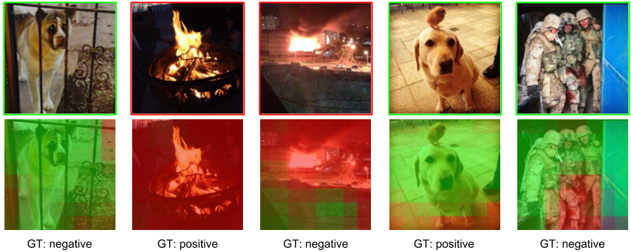

# From Pixels to Sentiment: Fine-tuning CNNs for Visual Sentiment Prediction
## Image and Vision Computing

| ![Víctor Campos][VictorCampos-photo]  | ![Brendan Jou][BrendanJou-photo] |  ![Xavier Giro-i-Nieto][XavierGiro-photo]  | 
|:-:|:-:|:-:|
| [Víctor Campos](https://www.linkedin.com/in/victor-campos-camunez) | [Brendan Jou](http://www.ee.columbia.edu/~bjou/) |  [Xavier Giro-i-Nieto](https://imatge.upc.edu/web/people/xavier-giro) |


[VictorCampos-photo]: ./figures/authors/VictorCampos.jpg "Víctor Campos"
[BrendanJou-photo]: ./figures/authors/BrendanJou.png "Brendan Jou"
[XavierGiro-photo]: ./figures/authors/XavierGiro.jpg "Xavier Giro-i-Nieto"


A joint collaboration between:

|  ![logo-bsc] | ![logo-upc] | ![logo-gpi] | ![logo-columbia] | ![logo-dvmmlab] |
|:-:|:-:|:-:|:-:|:-:|
| [Barcelona Supercomputing Center (BSC)](https://www.bsc.es/)  |  [Universitat Politecnica de Catalunya (UPC)](http://www.upc.edu/?set_language=en)   | [UPC Image Processing Group](https://imatge.upc.edu/web/) | [Columbia University](https://www.columbia.edu/ ) | [Digital Video and Multimedia Lab (DVMM)](www.ee.columbia.edu/dvmm)  |

[logo-upc]: ./figures/logos/upc.jpg "Universitat Politècnica de Catalunya"
[logo-bsc]: ./figures/logos/bsc.jpg "Barcelona Supercomputing Center"
[logo-gpi]: ./figures/logos/gpi.png "UPC Image Processing Group"
[logo-columbia]: ./figures/logos/columbia.png "Columbia University"
[logo-dvmmlab]: ./figures/logos/dvmm.gif "Digital Video and Multimedia Lab"


## Abstract
Visual multimedia have become an inseparable part of our digital social lives, and they often capture moments tied with deep affections. Automated visual sentiment analysis tools can provide a means of extracting the rich feelings and latent dispositions embedded in these media. In this work, we explore how Convolutional Neural Networks (CNNs), a now de facto computational machine learning tool particularly in the area of Computer Vision, can be specifically applied to the task of visual sentiment prediction. We accomplish this through fine-tuning experiments using a state-of-the-art CNN and via rigorous architecture analysis, we present several modifications that lead to accuracy improvements over prior art on a dataset of images from a popular social media platform. We additionally present visualizations of local patterns that the network learned to associate with image sentiment for insight into how visual positivity (or negativity) is perceived by the model.

## Publication

Our [article](http://dx.doi.org/10.1016/j.imavis.2017.01.011) can be found on ScienceDirect. A [preprint](http://arxiv.org/abs/1604.03489) is publicly available on arXiv as well. You can also find it indexed [on gitxiv](http://gitxiv.com/posts/ruqRgXdPTHJ77LDEb/from-pixels-to-sentiment-fine-tuning-cnns-for-visual).


Please cite with the following Bibtex code:

```
@article{campos2017from,
  title={From Pixels to Sentiment: Fine-tuning CNNs for Visual Sentiment Prediction},
  author={Campos, Victor and Jou, Brendan and Giro-i-Nieto, Xavier},
  journal={Image and Vision Computing},
  year={2017}
}
```

You may also want to refer to our publication with the more human-friendly APA style:

*Campos, V., Jou, B., & Giro-i-Nieto, X. (2017, February). [From Pixels to Sentiment: Fine-tuning CNNs for Visual Sentiment Prediction](http://dx.doi.org/10.1016/j.imavis.2017.01.011). Image and Vision Computing.*


## Sentiment Maps




## Data

The Twitter dataset used in our experiments can be downloaded from [here](http://www.cs.rochester.edu/u/qyou/DeepSent/deepsentiment.html).

## Models

The weights for the best CNN model can be downloaded from [here](https://imatge.upc.edu/web/sites/default/files/projects/affective/public_html/2017-imavis/twitter_finetuned_test4_iter_180.caffemodel) (217 MB). These same weights, modified to fit the fully convolutional architecture used to generate the sentiment maps, can be downloaded from [here](https://imatge.upc.edu/web/sites/default/files/projects/affective/public_html/2017-imavis/twitter_finetuned_test4_iter_180_conv.caffemodel) (217 MB).

The deep network was developed over [Caffe](http://caffe.berkeleyvision.org/) by [Berkeley Vision and Learning Center (BVLC)](http://bvlc.eecs.berkeley.edu/). You will need to follow [these instructions](http://caffe.berkeleyvision.org/installation.html) to install Caffe.


## Acknowledgments

We would like to especially thank Albert Gil and Josep Pujal from our technical support team at the Image Processing Group at UPC and Carlos Tripiana from the technical support team at the Barcelona Supercomputing Center.

| ![AlbertGil-photo]  | ![JosepPujal-photo]  | ![CarlosTripiana-photo]  |
|:-:|:-:|:-:|
| [Albert Gil](https://imatge.upc.edu/web/people/albert-gil-moreno)  |  [Josep Pujal](https://imatge.upc.edu/web/people/josep-pujal) |  [Carlos Tripiana](https://www.bsc.es/tripiana-carlos)

[AlbertGil-photo]: ./figures/authors/AlbertGil.jpg "Albert Gil"
[JosepPujal-photo]: ./figures/authors/JosepPujal.jpg "Josep Pujal"
[CarlosTripiana-photo]: ./figures/authors/CarlosTripiana.jpg "Carlos Tripiana"

|   |   |
|:--|:-:|
| This work has been supported by the [grant SEV2015-0493 of the Severo Ochoa Program](https://www.bsc.es/es/severo-ochoa/presentaci%C3%B3n) awarded by Spanish Government, project TIN2015-65316 by the Spanish Ministry of Science and Innovation contracts 2014-SGR-1051 by Generalitat de Catalunya | ![logo-severo] |
|  We gratefully acknowledge the support of [NVIDIA Corporation](http://www.nvidia.com/content/global/global.php) through the BSC/UPC NVIDIA GPU Center of Excellence. |  ![logo-gpu_excellence_center] |
|  The Image ProcessingGroup at the UPC is a [SGR14 Consolidated Research Group](https://imatge.upc.edu/web/projects/sgr14-image-and-video-processing-group) recognized and sponsored by the Catalan Government (Generalitat de Catalunya) through its [AGAUR](http://agaur.gencat.cat/en/inici/index.html) office. |  ![logo-catalonia] |
|  This work has been developed in the framework of the project [BigGraph TEC2013-43935-R](https://imatge.upc.edu/web/projects/biggraph-heterogeneous-information-and-graph-signal-processing-big-data-era-application), funded by the Spanish Ministerio de Economía y Competitividad and the European Regional Development Fund (ERDF).  | ![logo-spain] | 


[logo-gpu_excellence_center]: ./figures/logos/gpu_excellence_center.png "Logo of NVidia"
[logo-catalonia]: ./figures/logos/generalitat.jpg "Logo of Catalan government"
[logo-spain]: ./figures/logos/MEyC.png "Logo of Spanish government"
[logo-severo]: https://github.com/imatge-upc/detection-2016-nipsws/blob/master/logos/severo_ochoa.png?raw=true "Severo Ochoa"


## Contact

If you have any general doubt about our work or code which may be of interest for other researchers, please use the [public issues section](https://github.com/imatge-upc/sentiment-2016-imavis/issues) on this github repo. Alternatively, drop us an e-mail at <mailto:victor.campos@bsc.es>.
